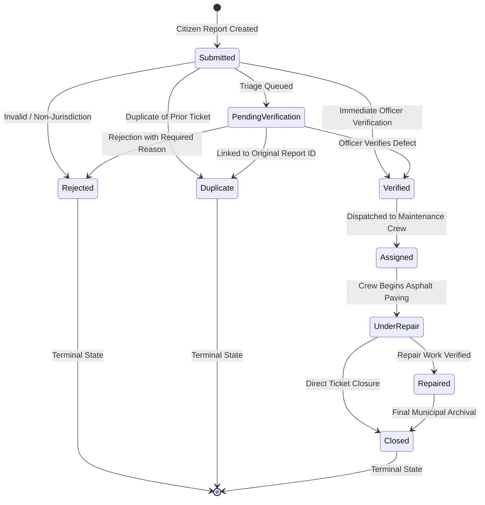

# CivicSight 🏛️🛣️

> **Smart Road Damage Detection and Municipal Repair Management System**

CivicSight is an intelligent civic-tech platform bridging the gap between citizen road hazard reporting, AI-driven computer vision damage triage, and municipal maintenance dispatch.

---

## 🔄 End-to-End Workflow

```text
[ Citizen ] ──> Report (Road Hazard / Damage)
                     │
                     ▼
[ ML Engine ] ─> Detect (YOLO Damage Classification: D00, D10, D20, D40)
                     │
                     ▼
[ Backend ] ───> Prioritize (Severity Scoring & Location Clustering)
                     │
                     ▼
[ Municipal ] ─> Verify (Official Inspection & Validation)
                     │
                     ▼
[ Ops Hub ] ───> Assign (Contractor / Work Order Dispatch)
                     │
                     ▼
[ Field Crew ] ─> Repair (Maintenance Execution)
                     │
                     ▼
[ System ] ────> Close (Resolution Verification & Citizen Notification)
```

---

## 📁 Repository Structure (Week 3 Architecture)

This repository is structured as a modular monorepo:

```text
CivicSight/
├── frontend/                     # Citizen portal & reporting interface (Vanilla HTML/CSS/JS)
│   ├── assets/                   # Logos, icons, and media
│   ├── css/
│   │   └── style.css             # Design tokens, auth forms, role badges, and layout
│   ├── js/
│   │   ├── app.js                # Core landing page interactivity and notifications
│   │   ├── auth.js               # JWT session management & dynamic role-based navigation (Week 3)
│   │   └── report.js             # Interactive photo dropzone, preview, & live API submission (Week 3)
│   ├── pages/
│   │   ├── login.html            # User Sign In interface with error handling (Week 3)
│   │   ├── register.html         # User Registration with role selection & validation (Week 3)
│   │   ├── report.html           # Citizen Damage Reporting Page
│   │   └── index.html            # Redirect helper
│   └── index.html                # Main landing page with dynamic post-login navigation
│
├── backend/                      # FastAPI REST API & Database engine
│   ├── app/
│   │   ├── api/v1/
│   │   │   ├── endpoints/
│   │   │   │   ├── auth.py       # Registration, Login, Profile & RBAC example endpoints (Week 3)
│   │   │   │   ├── users.py      # User entity CRUD REST endpoints (extended with roles/hashes)
│   │   │   │   └── reports.py    # Road damage Report CRUD & status transition endpoints
│   │   │   └── router.py         # Versioned API router mounting (/api/v1)
│   │   ├── core/
│   │   │   ├── config.py         # App settings, DB URI & JWT configuration (Week 3)
│   │   │   ├── dependencies.py   # Auth & RoleChecker RBAC dependencies (Week 3)
│   │   │   └── security.py       # Bcrypt hashing & PyJWT token encoding/decoding (Week 3)
│   │   ├── db/
│   │   │   ├── database.py       # SQLAlchemy engine & session lifecycle
│   │   │   └── init_db.py        # Table initialization & column migration (Week 3)
│   │   ├── models/
│   │   │   └── models.py         # SQLAlchemy models (User with role/hash, Report, ReportStatus)
│   │   ├── schemas/
│   │   │   ├── schemas.py        # Pydantic models (UserRegister, UserLogin, Token, UserResponse)
│   │   │   └── __init__.py       # Schema exports
│   │   └── main.py               # FastAPI entrypoint, CORS, lifespan, auth routers, & health checks
│   ├── test_auth.py              # Automated test suite for registration, login, JWT, & RBAC (Week 3)
│   ├── test_crud.py              # Automated 100% CRUD test suite against PostgreSQL
│   ├── .env.example              # Environment variables template
│   └── requirements.txt          # Backend dependencies (fastapi, bcrypt, pyjwt, sqlalchemy, etc.)
│
├── ml/                           # Computer Vision & Damage Detection subsystem
│   ├── data.yaml                 # Standard YOLOv8 dataset configuration (Week 3)
│   ├── runs/                     # Detection runs & dataset distribution charts
│   ├── samples/
│   │   ├── verified_boxes/       # Visual bounding box verification overlays (Week 3)
│   │   └── sample_road.jpg       # Sample baseline road image
│   ├── scripts/
│   │   ├── analyze_dataset.py    # RDD2022 pairing, format verification & distribution analysis
│   │   ├── test_inference.py     # Pretrained YOLOv8n baseline verification
│   │   └── verify_dataset_and_visualize.py # Dataset split audit & visual overlay renderer (Week 3)
│   ├── notes.md                  # Dataset notes, YAML specifications, & verification steps (Week 3)
│   ├── README.md                 # RDD2022 dataset specifications and class taxonomy
│   └── requirements.txt          # PyTorch, Ultralytics YOLO & CV dependencies
│
├── Dataset/                      # Local RDD2022 splits (train/val/test)
│   └── RDD_SPLIT/                # 38,385 organized image/label pairs across train/val/test
└── README.md                     # Monorepo documentation (this file)
```

---

## 🌟 Week 3 Progress Summary

### 1. Backend Subsystem (`/backend` — Authentication & Roles)
- **User Model Extension (`app/models/models.py`)**:
  - Added `hashed_password` field (stored securely using direct `bcrypt` hashing — never in plaintext).
  - Added `role` field using `UserRole` enum supporting:
    - **`Citizen`**: Public user reporting hazards and viewing resolution status.
    - **`Municipal Officer`**: Official validating reports, estimating scopes, and authorizing dispatches.
    - **`Maintenance Staff`**: Field technicians receiving work orders and executing asphalt repairs.
    - **`Admin`**: System administrator with global oversight and configuration management.
- **Independent Backend Validation**:
  - `UserRegister` and `UserLogin` schemas independently enforce email format regex, password length (min 6 chars), required fields, and duplicate email prevention, regardless of client-side validation.
- **Authentication Endpoints (`app/api/v1/endpoints/auth.py`)**:
  - `POST /auth/register` (and `/api/v1/auth/register`): Hashes password via bcrypt, persists User record, returns sanitized `UserResponse`.
  - `POST /auth/login` (and `/api/v1/auth/login`): Verifies credentials against bcrypt hash, issues signed PyJWT token, handles invalid credentials uniformly without leaking user existence.
  - `GET /api/v1/auth/me`: Authenticated profile endpoint decoding JWT Bearer token.
- **Separation of Authentication & Authorization (`app/core/dependencies.py`)**:
  - `get_current_user`: Authentication dependency verifying JWT signature and database user.
  - `RoleChecker` / `require_roles`: Reusable authorization dependency. Demonstrated on `GET /api/v1/auth/protected-role-example` (accessible to `Admin` & `Municipal Officer`, returns `403 Forbidden` for other roles).
- **Automated Test Suite (`backend/test_auth.py`)**: 100% pass rate across edge cases, duplicate email checks, wrong passwords, JWT validation, and RBAC gating.

### 2. Frontend Subsystem (`/frontend` — Auth Screens & Navigation)
- **Registration Page (`pages/register.html`)**:
  - Collects Full Name, Email, Phone, Role selection, and Password with confirmation.
  - Includes client-side UX validation (matching passwords, email regex, min length) and direct asynchronous connection to backend `POST /api/v1/auth/register`.
- **Login Page (`pages/login.html`)**:
  - Secure credential form connecting to `POST /api/v1/auth/login`.
  - Displays structured error banners on failed attempts without leaking credential details.
  - Automatically captures prefilled email when redirected from registration.
- **Dynamic Role-Aware Navigation (`js/auth.js`)**:
  - Reusable auth module managing `localStorage` JWT tokens and user session data.
  - Dynamically updates header: logged-in state shows user avatar, name, color-coded role badge (`Citizen`, `Municipal Officer`, `Maintenance Staff`, `Admin`), and a Sign Out button.
  - Prepares role-specific navigation sections in the menu bar.
- **Report Damage Integration (`pages/report.html`)**:
  - Form now connects to live backend `POST /api/v1/reports`, automatically associating the report with the logged-in user ID when authenticated.

### 3. ML Subsystem (`/ml` — Dataset Preparation & Visual Verification)
- **Dataset Split Organization (`Dataset/RDD_SPLIT/`)**:
  - Standardized **38,385** image-label pairs into `train/` (26,869 pairs, ~70%), `val/` (5,758 pairs, ~15%), and `test/` (5,758 pairs, ~15%).
- **YOLO Dataset Configuration (`ml/data.yaml`)**:
  - Mapped paths and 4-class taxonomy: `0: D00 (Longitudinal Crack)`, `1: D10 (Transverse Crack)`, `2: D20 (Alligator Crack)`, `3: D40 (Pothole)`.
- **Class Consistency & Coordinate Validation (`ml/scripts/verify_dataset_and_visualize.py`)**:
  - Verified 100% of non-empty labels are mapped to `{0, 1, 2, 3}` and coordinates are bounded within `[0.0, 1.0]`.
- **Visual Bounding Box Verification Overlays**:
  - Rendered colored bounding boxes with labeled banners for all damage classes into `ml/samples/verified_boxes/` confirming ground-truth alignment with pavement defects.
- **Documentation (`ml/notes.md`)**: Comprehensive documentation of dataset prep, class mappings, and repeatable verification procedures. Model training remains scheduled for Week 4.

---

## 👥 System Role Specifications (Week 3)

| Role | Target Persona | Week 3 Permissions / Access Scope |
|:---|:---|:---|
| **`Citizen`** | General Public | Register, log in, submit damage reports with photos/coordinates, view own report status. |
| **`Municipal Officer`** | Public Works Inspector / Engineer | Log in, access protected triage verification endpoints (`/api/v1/auth/protected-role-example`), review incident priority. |
| **`Maintenance Staff`** | Field Repair Crew Technician | Log in, view work order queue (pre-wired in nav), submit repair completion data. |
| **`Admin`** | System Administrator | Full access across all municipal endpoints, user role audits, and administrative operations. |

> [!NOTE]
> Role-Based Access Control (RBAC) has been introduced and proven on example endpoints (`/auth/protected-role-example`). Endpoints will be progressively locked down to specific roles in upcoming phases.

---

## 🚀 Getting Started & Execution Guide

### 1. Backend Authentication & API Reference

#### Install Dependencies & Migrate Tables
```bash
cd backend
pip install -r requirements.txt
python -c "from app.db.init_db import init_db; init_db()"
uvicorn app.main:app --reload --port 8000
```

#### Run Automated Test Suites
```bash
# Run Week 3 Authentication & RBAC Test Suite
python test_auth.py

# Run Week 2 CRUD Test Suite
python test_crud.py
```

#### Example Auth API Requests

- **1. Register a New User (`POST /api/v1/auth/register` or `/auth/register`)**:
  ```bash
  curl -X POST "http://127.0.0.1:8000/api/v1/auth/register" \
    -H "Content-Type: application/json" \
    -d '{
      "name": "Jane Citizen",
      "email": "jane.citizen@example.com",
      "password": "SecurePassword123!",
      "phone": "+1-555-0199",
      "role": "Citizen"
    }'
  ```

- **2. Authenticate & Obtain JWT Token (`POST /api/v1/auth/login` or `/auth/login`)**:
  ```bash
  curl -X POST "http://127.0.0.1:8000/api/v1/auth/login" \
    -H "Content-Type: application/json" \
    -d '{
      "email": "jane.citizen@example.com",
      "password": "SecurePassword123!"
    }'
  ```
  *Response:*
  ```json
  {
    "access_token": "eyJhbGciOiJIUzI1Ni...",
    "token_type": "bearer",
    "user": {
      "id": 1,
      "name": "Jane Citizen",
      "email": "jane.citizen@example.com",
      "role": "Citizen"
    }
  }
  ```

- **3. Get Authenticated Profile (`GET /api/v1/auth/me`)**:
  ```bash
  curl -X GET "http://127.0.0.1:8000/api/v1/auth/me" \
    -H "Authorization: Bearer <YOUR_ACCESS_TOKEN>"
  ```

- **4. Access Role-Gated Endpoint (`GET /api/v1/auth/protected-role-example`)**:
  ```bash
  # Returns 200 OK for 'Admin' or 'Municipal Officer' tokens
  # Returns 403 Forbidden for 'Citizen' or 'Maintenance Staff' tokens
  curl -X GET "http://127.0.0.1:8000/api/v1/auth/protected-role-example" \
    -H "Authorization: Bearer <YOUR_ACCESS_TOKEN>"
  ```

---

### 2. Frontend Subsystem

- Open `frontend/index.html` in your browser, or serve via local server:
  ```bash
  python -m http.server 3000 --directory frontend
  ```
- **Registration**: Navigate to `http://localhost:3000/pages/register.html`
- **Login**: Navigate to `http://localhost:3000/pages/login.html`
- **Report Damage**: Navigate to `http://localhost:3000/pages/report.html`

---

### 3. ML Subsystem (Dataset Verification)

```bash
cd ml
# Run the dataset split audit and generate visual bounding box overlays
python scripts/verify_dataset_and_visualize.py
```
Visual verification overlays will be generated in `ml/samples/verified_boxes/`.

---

## 📌 Development Roadmap

- [x] **Week 1**: Monorepo Scaffolding, Landing Page, FastAPI + PostgreSQL Health Check, ML Environment Verification
- [x] **Week 2**: Citizen Reporting Interface (Photo/GPS Scaffolding), Backend Models & CRUD REST API, RDD2022 Dataset Analysis
- [x] **Week 3**: Authentication & JWT Sessions, Multi-Role Architecture (`Citizen`, `Municipal Officer`, `Maintenance Staff`, `Admin`), Frontend Auth Pages & Role-Aware Nav, ML Dataset Preparation (`data.yaml`, Splits & Visual Auditing)
- [x] **Week 4**: End-to-End Reporting Workflow (Leaflet Map + Geolocation + Multipart Upload), Report Creation API with Disk Storage & Server-Side Validation, ML Input Pipeline (`preprocess.py`) & Baseline YOLOv8 Experiment
- [ ] **Week 5**: Maintenance Work Order Dispatch, Repair Status Tracking, & Citizen Notification Workflows

---

## 🚀 Week 4 Progress: End-to-End Reporting, Spatial Maps & ML Baseline

### 1. Citizen Reporting Page (`frontend/pages/report.html`, `frontend/js/report.js`)
- **Interactive Leaflet Map Integration**:
  - Embedded OpenStreetMap canvas allowing citizens to pinpoint exact hazard coordinates.
  - Interactive, draggable marker with automatic coordinate synchronization into form inputs (`latitude`, `longitude`).
  - Click-to-pin support anywhere on the map surface.
- **Browser Geolocation & Resilient Fallback**:
  - Automated GPS location query via `navigator.geolocation.getCurrentPosition()`.
  - **Granted**: Auto-centers map (`zoom 16`) and drops pin at device coordinates with accuracy indicator.
  - **Denied/Unavailable**: Gracefully falls back to default city view and informs user to manually click on the map without breaking the form.
  - "Locate Me (GPS)" button to re-trigger geolocation on demand.
- **Photo Upload & Live Preview**:
  - Drag-and-drop file dropzone with instant client-side preview, file size/type validation, and replacement options.
- **Submission States & Feedback**:
  - Visually distinct feedback banners: **submitting** (spinner), **success** (green banner with Report ID, status, and coordinates), and **error** (red banner with specific server/validation message).
- **Two-Theme Compliance**:
  - 100% styled using pure CSS variables (`--bg-primary`, `--bg-secondary`, `--text-primary`, `--accent-color`, etc.).
  - Leaflet controls, zoom buttons, popups, and dark-mode tile inverted greyscale filter tested and validated in both Plain White and Plain Black themes.

---

### 2. Report Creation API (`POST /api/v1/reports` & `POST /reports`)
- **Multipart/Form-Data Image Upload**:
  - Accepts raw image binary (`image`), `description`, `latitude`, `longitude`, optional `address_text`, `damage_type`, and `reporter_id`.
  - Also maintains backwards-compatible JSON request handling for automated testing.
- **Disk Storage Architecture**:
  - Stores uploaded photos in `backend/uploads/reports/{uuid}.{ext}`.
  - Stores only the relative URL path (`/uploads/reports/{filename}`) in PostgreSQL — **zero raw binary blobs in database**.
  - Static file hosting mounted at `/uploads` via FastAPI `StaticFiles`.
- **Strict Server-Side Validation (Zero Trust)**:
  - Validates image presence and MIME/extension (`.jpg`, `.jpeg`, `.png`, `.webp`, `.jfif`).
  - Validates non-empty description.
  - Validates numeric bounds: `-90.0 <= latitude <= 90.0` and `-180.0 <= longitude <= 180.0`.
  - Returns `422 Unprocessable Content` with descriptive field-specific errors before touching PostgreSQL.
- **Response Format**:
  ```json
  {
    "id": 11,
    "description": "Severe road damage and pothole hazard near crosswalk.",
    "latitude": 37.77574,
    "longitude": -122.432663,
    "address_text": "452 Elm Street near Metro Gate 2",
    "image_url": "/uploads/reports/141f0b35065e425eb887adc5cdcd7656.jpg",
    "damage_type": "D40",
    "status": "submitted",
    "severity_score": null,
    "reporter_id": null,
    "created_at": "2026-09-11T16:35:57.176408",
    "updated_at": "2026-09-11T16:35:57.176408"
  }
  ```

---

### 3. ML Subsystem: Input Preprocessing & Baseline Experiment
- **Reusable Image Preprocessing Pipeline (`ml/src/preprocess.py`)**:
  - Function `preprocess_report_image()` accepts file path, PIL Image, or NumPy array.
  - Implements letterbox aspect-ratio preserving resize (default 640x640) with neutral gray border padding.
  - Converts BGR/RGBA to RGB, normalizes `[0, 255] -> [0.0, 1.0]`, transposes to CHW, and generates `[1, 3, 640, 640]` PyTorch tensor ready for YOLO inference.
  - Tracks scaling ratios and padding offsets for downstream bounding box coordinate inversion.
  - Automated unit test suite verified: `python ml/scripts/test_preprocess.py` (100% pass).
- **First Baseline YOLOv8 Training Experiment (`ml/scripts/train_baseline.py`)**:
  - Model: `YOLOv8n` (3.0M parameters, 8.1 GFLOPs)
  - Dataset: Balanced RDD2022 subset across all 4 defect classes (D00, D10, D20, D40).
  - Hyperparameters: `epochs=2`, `imgsz=640`, `batch=8`, `device=cpu`, `optimizer=auto (AdamW)`.
  - Initial Results:
    - **Overall mAP@0.5**: `0.0335`
    - **Overall mAP@0.5:0.95**: `0.0114`
    - **Mean Recall**: `50.2%`
  - **Class Detectability Findings**:
    - **D10 (Transverse Cracks)** and **D40 (Potholes)** showed highest relative initial detectability (`mAP50 ~ 0.022-0.046`, recall up to `90.0%` on potholes due to salient shadow boundaries).
    - **D00 (Longitudinal Cracks)** and **D20 (Alligator Cracks)** proved noticeably harder to isolate from background road texture in the initial baseline pass, requiring higher resolution and deeper feature extraction.
  - Documented in `ml/experiments/baseline_results.json` and `ml/experiments/baseline_report.md`.

---

## 🏛️ Week 5 Progress Summary

Week 5 transforms the municipal operations workflow into a fully functional, role-gated platform with live backend report management, dynamic triage filtering, in-place report verification, and an optimized ML baseline model.

### 1. Backend Subsystem: Municipal Report Management & RBAC
- **Role-Gated Endpoints (`backend/app/api/v1/endpoints/reports.py`)**:
  - `GET /reports` (and `/api/v1/reports`): Returns road hazard listing with ID, location, priority, status, image URL, and timestamps.
  - `GET /reports/{id}` (and `/api/v1/reports/{id}`): Returns full report details, reporter profile, and structured ML detection results.
  - `PATCH /reports/{id}/verify` (and `/api/v1/reports/{id}/verify`): Transitions a report to `verified`. Rejects reports that are already `repaired` or `closed` with `400 Bad Request`.
- **Strict Role-Based Access Control**:
  - Restricted to `Municipal Officer` and `Admin` via reusable dependency `require_roles(UserRole.MUNICIPAL_OFFICER, UserRole.ADMIN)`.
  - Unauthenticated requests receive `401 Unauthorized`.
  - Authenticated requests with `Citizen` or `Maintenance Staff` roles receive `403 Forbidden`.
- **Query Parameter Filtering**:
  - Supports `?status=...` (submitted, verified, assigned, repaired, closed) and `?priority=...` (HIGH, MEDIUM, LOW).
  - Fully supports combining both query filters simultaneously (e.g., `?status=submitted&priority=HIGH`).
- **Database Schema Migrations (`backend/app/models/models.py` & `init_db.py`)**:
  - Added indexed `priority` column (`HIGH`, `MEDIUM`, `LOW`) with intelligent defect-based auto-inferencing (`D40`/`D20` -> `HIGH`, `D00`/`D10` -> `MEDIUM`).
  - Added `ml_detections` text column storing validated JSON detection bounding boxes.
- **Automated Test Suites**:
  - `backend/test_municipal_reports_api.py`: 100% pass across 7 test suites (unauth 401s, citizen 403s, officer 200s, 404s, combined filtering, verification workflow, closed rejection).
  - `backend/test_auth.py`: 100% pass across user registration, login, JWT validation, and RBAC guards.

---

### 2. Frontend Subsystem: Municipal Operations Center
- **Route Guarding (`frontend/js/dashboard.js`)**:
  - Automatically checks active JWT session and role. Unauthenticated visitors are redirected to `login.html`.
  - Citizen accounts encounter a dedicated **"Access Restricted"** screen explaining the restriction to Municipal Officers/Admins, with single-click navigation back to citizen reporting.
- **Live Backend Integration (No Mock Data)**:
  - Fetches live report records from `GET /api/v1/reports` using Bearer authentication.
  - Dynamic KPI metric counters: Active Hazards, High Severity, Medium Priority, and Repaired/Closed tickets.
- **Dynamic Query Filtering**:
  - Interactive status and priority dropdowns wired directly to backend query params.
  - Updates table and map pins instantaneously upon selection, with a single-click "Reset Filters" action.
- **Inspection Modal with Visual AI Detection**:
  - Reuses the `CivicSightMLViewer` component to render defect images, interactive SVG bounding box overlays, confidence chips, and geospatial coordinates.
- **In-Place Report Verification**:
  - Modal and triage table feature a **"Verify Report"** action calling `PATCH /api/v1/reports/{id}/verify`.
  - State updates to `verified` immediately across table badges, modal indicators, and Leaflet map popups **without a full page reload**.
- **Design & Theme Consistency**:
  - Strict adherence to the plain white / plain black CSS variable token system (`--bg-primary`, `--bg-secondary`, `--text-primary`, `--border-color`, `--accent-color`).
  - Tested and visually verified in both Light and Dark modes.

---

### 3. ML Subsystem: Baseline Optimization & Experiment 2
- **Training Experiment 2 (`ml/scripts/train_experiment2.py`)**:
  - Implemented deliberate configuration changes:
    1. Input resolution reduced to `512x512` for CPU inference efficiency and tighter crack receptive fields.
    2. Training duration increased to `3 epochs` (+50% optimization steps).
    3. Cosine learning rate scheduling enabled (`cos_lr=True`, `lr0=0.01`).
- **Comparative Metrics Breakdown**:

| Metric | Experiment 1 (Week 4 Baseline) | Experiment 2 (Week 5 Run) | Delta (Exp 2 vs Exp 1) |
|:---|:---:|:---:|:---:|
| **Mean Precision (P)** | `0.0041` | **`0.6541`** | **+0.6500 (+15,853%)** |
| **Mean Recall (R)** | `0.5024` | `0.1254` | -0.3770 |
| **Overall mAP@0.5** | `0.0335` | **`0.1176`** | **+0.0841 (+251.0%)** |
| **Overall mAP@0.5:0.95** | `0.0114` | **`0.0530`** | **+0.0416 (+364.9%)** |
| **D00 (Longitudinal)** | `0.0002` | **`0.0419`** | +0.0417 |
| **D10 (Transverse)** | `0.0224` | **`0.0419`** | +0.0195 |
| **D20 (Alligator)** | `0.0006` | `0.0001` | -0.0005 |
| **D40 (Pothole)** | `0.0222` | **`0.1281`** | **+0.1059 (+477%)** |

- **Baseline Selection**:
  - **Experiment 2 (`experiment2_week5`)** selected as canonical baseline model.
  - Weights preserved in `ml/runs/detect/experiment2_week5/weights/best.pt`.
  - Comprehensive comparison and technical reasoning documented in `ml/experiments/results.md`.
  - *Integration Boundary:* Model inference integration into backend endpoint is deferred to Week 6 as scheduled.

---

## 🚀 Week 6 Progress Summary

Week 6 transitions CivicSight from static report viewing to an **active, auditable municipal report lifecycle** with strict server-side state machine validation, full status history tracking, dashboard lifecycle actions, and a **finalized, reusable ML inference module** tested on held-out data.

### 1. Full Status Lifecycle State Machine



#### Strict Server-Side Transition Validation Rules:
- **No Unverified Assignment:** A report **cannot** be assigned before it is verified (`Submitted/PendingVerification -> Assigned` returns `400 Bad Request`).
- **No Post-Assignment Rejection:** A report **cannot** be rejected once assigned or under repair (`Assigned -> Rejected` returns `400 Bad Request`).
- **No Re-verification of Closed Work:** Closed or repaired reports **cannot** be re-verified (`Closed/Repaired -> Verified` returns `400 Bad Request`).
- **Explicit Transition Map:** Enforced via `LEGAL_TRANSITIONS` map in [`backend/app/api/v1/endpoints/reports.py`](file:///d:/Projects/CivicSight/backend/app/api/v1/endpoints/reports.py).

---

### 2. Backend Subsystem: Lifecycle Endpoints & History Tracking
- **Lifecycle Action Endpoints (`backend/app/api/v1/endpoints/reports.py`)**:
  - `PATCH /reports/{id}/verify`: Moves report from `submitted` / `pending_verification` to `verified`.
  - `PATCH /reports/{id}/reject`: Moves report to `rejected`. Requires `reason` string in payload.
  - `PATCH /reports/{id}/duplicate`: Marks report as `duplicate`. Requires `original_report_id` integer referencing an existing valid report.
  - `PATCH /reports/{id}/assign`: Moves report to `assigned`. Requires `assigned_to` string designating the maintenance crew or staff member.
  - `PATCH /reports/{id}/status`: General lifecycle state transitions (e.g. `assigned` -> `under_repair` -> `repaired` -> `closed`).
  - `GET /reports/{id}/history`: Returns complete chronological status transition history.
- **Audit History Storage (`ReportStatusHistory` model)**:
  - Automatically records every transition: `report_id`, `from_status`, `to_status`, `changed_by_id`, `changed_by_name`, `role`, `timestamp`, and `note`.
  - Initial report creation automatically seeds the first history entry (`Submitted`).
- **Strict Role-Based Access Control (RBAC)**:
  - All lifecycle mutation and history endpoints remain strictly restricted to `Municipal Officer` and `Admin` roles.
  - Unauthenticated requests receive `401 Unauthorized`.
  - Citizen and Maintenance Staff roles receive `403 Forbidden`.

---

### 3. Frontend Subsystem: Lifecycle Actions & Real History Audit Timeline
- **Dashboard Lifecycle Action Controls (`frontend/js/dashboard.js` & `pages/dashboard.html`)**:
  - **Dynamic Action Button Gating:** Actions strictly mirror backend state machine rules:
    * `Submitted` / `Pending Verification`: Displays `Verify Report`, `Reject...`, and `Duplicate...`. Hides `Assign Crew`.
    * `Verified`: Displays `Assign Crew...`. Hides `Verify Report`, `Reject`, and `Duplicate`.
    * `Assigned` / `Under Repair` / `Repaired` / `Closed`: Mutative verification/rejection controls hidden.
  - **Interactive Action Modals**:
    * **Reject Modal (`#rejectModal`):** Prompts officer for mandatory rejection reason and optional internal audit note.
    * **Duplicate Modal (`#duplicateModal`):** Dropdown populated with active reports plus direct ID input.
    * **Assign Modal (`#assignModal`):** Crew selector with predefined division units or custom contractor entry.
- **Real Status Transition Audit Timeline (`#modalHistoryTimeline`)**:
  - Dynamically fetches and renders real events from `GET /api/v1/reports/{id}/history`.
  - Displays transition badge (`Old Status -> New Status`), performer name, role, timestamp, and audit notes.
- **Theme-Adherent Status Badges**:
  - Reuses established design tokens across both Light and Dark modes (`.status-submitted`, `.status-verified`, `.status-assigned`, `.status-under_repair`, `.status-repaired`, `.status-closed`, `.status-rejected`, `.status-duplicate`).

---

### 4. ML Subsystem: Finalized YOLO Model & Reusable Inference Module
- **Model Finalization**:
  - Canonical weights locked in at [`ml/runs/detect/experiment2_week5/weights/best.pt`](file:///d:/Projects/CivicSight/ml/runs/detect/experiment2_week5/weights/best.pt) (YOLOv8n trained on RDD2022).
- **Reusable Inference Module ([`ml/src/inference.py`](file:///d:/Projects/CivicSight/ml/src/inference.py))**:
  - Function: `detect_road_damage(image_input, confidence_threshold=0.25, iou_threshold=0.45, device="cpu")`.
  - Features: Singleton model caching to eliminate weight reloading overhead; polymorphic input support (filepath, Week 4 preprocessed dict, PIL Image, or NumPy array).
  - Exported via [`ml/src/__init__.py`](file:///d:/Projects/CivicSight/ml/src/__init__.py).
  - Returns structured output: detection list with class code (`D00`, `D10`, `D20`, `D40`), confidence score, absolute pixel bounding boxes, normalized `[0.0, 1.0]` coordinates, and aggregated priority (`HIGH`, `MEDIUM`, `LOW`).
- **Empirical Held-Out Testing & Failure Mode Analysis ([`ml/experiments/results.md`](file:///d:/Projects/CivicSight/ml/experiments/results.md))**:
  - Validated on unseen images from `Dataset/RDD_SPLIT/test/images`.
  - **Documented False Positives:** Overlapping fragmented bounding boxes on elongated fractures (`China_Drone_000008.jpg`); pavement expansion joint sealant misclassifications.
  - **Documented Missed Detections:** High-altitude aerial captures where cracks span <2 pixels (`China_Drone_000017.jpg`); D20 alligator fatigue mesh networks (`China_Drone_000053.jpg`); extreme-scale drone potholes (`China_Drone_000099.jpg`).
  - **Identified Failure Patterns:** Viewpoint discrepancy (drone aerial vs. street mount); precision-favoring threshold trade-off (`P=0.6541` vs `R=0.1254`).
- **Integration Boundary:** In accordance with constraints, the inference module is **not** wired into the backend API yet; full automated ingestion pipeline integration occurs in Week 7.

---

### 5. Automated Verification & Sanity Check Suite
- **Integration Sanity Suite ([`backend/test_integration_sanity_week6.py`](file:///d:/Projects/CivicSight/backend/test_integration_sanity_week6.py))**:
  - `test_checkpoint_1_valid_lifecycle_path`: **PASS** (Submitted -> Verified -> Assigned with 3 verified history entries).
  - `test_checkpoint_2_illegal_transitions_blocked`: **PASS** (Assign before Verify 400, Re-verify after Assigned 400, Reject after Assigned 400, Re-verify Closed 400).
  - `test_checkpoint_3_reject_and_duplicate_end_to_end`: **PASS** (Reason & Reference enforcement, self-duplicate 400, non-existent 404, history persistence).
  - `test_checkpoint_4_ml_inference_on_held_out_images`: **PASS** (Structured outputs validated across held-out images).
- **Comprehensive Lifecycle Suite ([`backend/test_lifecycle_api.py`](file:///d:/Projects/CivicSight/backend/test_lifecycle_api.py))**: **PASS (100%)**.
- **Municipal Reports RBAC Suite ([`backend/test_municipal_reports_api.py`](file:///d:/Projects/CivicSight/backend/test_municipal_reports_api.py))**: **PASS (100%)**.


